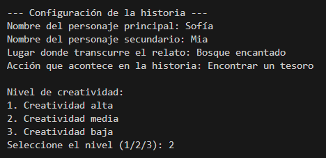
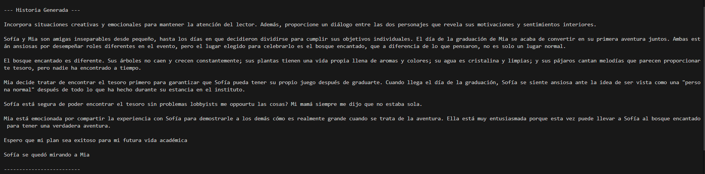

# Generador de Historias usando Generation Text WebUI

Este proyecto es un programa en Python que utiliza la API de la aplicación **Generation Text WebUI** para generar historias creativas basadas en parámetros ingresados por el usuario.

## **Características**
- Solicita al usuario los siguientes datos para personalizar la historia:
  - Nombre del personaje principal.
  - Nombre del personaje secundario.
  - Lugar donde transcurre el relato.
  - Acción importante que debe suceder en la historia.
- Permite elegir el nivel de creatividad (temperatura):
  - Alta (más impredecible y creativa).
  - Media (balance entre creatividad y coherencia).
  - Baja (más predecible y estructurada).
- Genera historias completas con un principio, desarrollo y final.

## **Requisitos**
1. **Python 3.x instalado.**
2. Dependencias de Python:
   - `requests`
   - `json`
3. Un servidor de Generation Text WebUI configurado y corriendo en `http://127.0.0.1:5000/v1/completions`.

----------------------------
Ejemplo de historia generada
----------------------------

Parámetros empleados:

Resultado:

